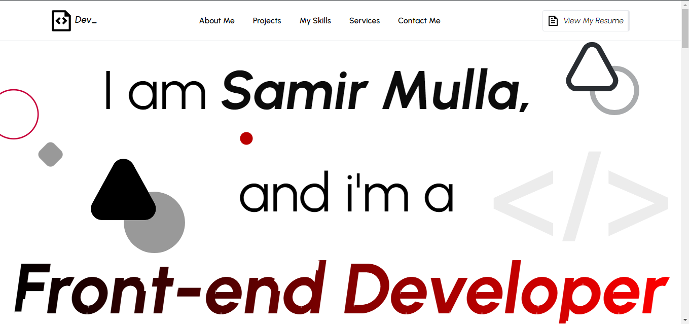

# My Portfolio Website

## Introduction

My Portfolio Website is a personal project designed to showcase my skills, projects, and experiences in web development. This project is built using modern web technologies and is intended to serve as a digital resume and a platform for sharing my work.

## website UI 
The website has a clean and minimalistic design, with a focus on showcasing my projects and skills.

## Live Demo

<u><a href="https://samirmulla-dev.netlify.app/">Click to see Live Demo</a></u>
